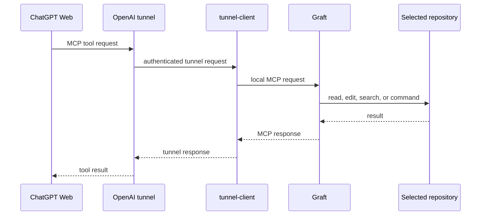

# Graft

Local coding tools for ChatGPT Web over MCP. ChatGPT provides the model; Graft runs on your machine and works only inside the workspace you select.

```text
ChatGPT Web → OpenAI tunnel → Graft → selected repository
```

Fork of [nghyane/hands](https://github.com/nghyane/hands). Not affiliated with OpenAI or xAI. Tool runtime: [Grok Build](https://github.com/xai-org/grok-build), Apache-2.0.
The GitHub repository remains [`KhanhD1nh/palmbridge`](https://github.com/KhanhD1nh/palmbridge) during migration.


## How it works

1. `graft setup` pins the current directory as the default workspace, stores tunnel credentials, writes a `tunnel-client` profile, and starts local services.
2. On macOS and Linux, `graft --http` starts an MCP server on `127.0.0.1:8787` and a private `0600` Unix socket for `tunnel-client`. Windows starts the same loopback MCP server as a companion process; its tunnel-client profile connects through `http://127.0.0.1:8787/mcp`.
3. `tunnel-client` authenticates to OpenAI using the restricted runtime key and binds the selected `tunnel_...` ID to the local MCP server.
4. ChatGPT's Tunnel connection sends MCP requests through that existing tunnel. Graft executes the requested tool against the pinned workspace and returns the result through the same path.



### Local processes and persistence

| Component | Role | Where it listens or persists |
|---|---|---|
| `graft --http` | MCP HTTP server and local configuration UI | `127.0.0.1:8787` |
| `tunnel-client` | Authenticated outbound connection to OpenAI | OpenAI control plane; health endpoint `127.0.0.1:18780` when running |
| Workspace pin | Defines the default repository for new MCP sessions | `~/.config/graft/workspace` on Unix; `%APPDATA%\graft\workspace` on Windows |
| Tunnel profile | Maps `tunnel-client` to Graft | `~/.config/tunnel-client/graft.yaml` on Unix; `%APPDATA%\tunnel-client\graft.yaml` on Windows |
| Runtime key file | Read by `tunnel-client`, never sent through MCP | Graft config directory, `0600` on Unix |

`graft config --open` serves only on loopback. It is a local control page, not a public dashboard.

### Workspace and access boundary

Graft is not a sandbox. The persisted workspace pin is only the default for new MCP sessions. Streamable HTTP clients that initialize normally receive an `Mcp-Session-Id`, and `set_workspace` changes only that MCP session; it does not rewrite the persisted default. File tools operate relative to the session workspace, but `run_terminal_cmd` still runs commands on the host with your user permissions. Treat access to the ChatGPT connection as access to the local account within ChatGPT's approval policy.

Use a separate OS account or a dedicated working directory when the machine contains repositories or files ChatGPT must not access. Never put keys, tokens, or private data into prompts or committed files.

### Credentials and network

- The runtime key authenticates `tunnel-client` to OpenAI. Restrict it to **Tunnels: Read** and **Tunnels: Use**.
- The `tunnel_...` ID identifies the tunnel; it is not a replacement for the runtime key.
- The local MCP server binds only to loopback. Unix tunnel traffic additionally uses a private Unix socket.
- Configuration UI mutations require JSON and reject mismatched browser origins/Host headers to reduce localhost CSRF and DNS-rebinding risk.
- MCP tool traffic uses the outbound tunnel. No inbound port-forwarding or public local listener is configured by Graft.
- On macOS, the key is also saved in Keychain when interactive setup succeeds. On Linux/Windows, Graft uses `secret-tool` when available. Every platform retains a local key file because `tunnel-client` requires a file-backed profile.
- `graft status --json` reports local process health; it does not prove ChatGPT authorization or a particular tool's permission.

### Lifecycle by platform

| Platform | MCP and tunnel lifecycle | Sleep/restart behavior |
|---|---|---|
| macOS | LaunchAgents start and keep services alive after login | AC power prevents idle sleep while tunnel waits; lid close on battery may suspend it |
| Linux | systemd user services start and restart services | Host/user session policy controls sleep and login behavior |
| Windows | Detached Graft supervisor owns MCP + `tunnel-client`, health-checks them, and restarts failed/hung children; a kill-on-close Job Object prevents orphan children | Supervisor is not installed as a boot service; run `graft start` after reboot |

## Security model

Graft does not contain a model or independently decide actions. ChatGPT chooses tools; the MCP tool annotations tell ChatGPT which operations are read-only or destructive. ChatGPT may still require confirmation based on its own policy. Treat **Never ask** as granting the connected ChatGPT app broad authority to operate with the local user account.


Audit before granting broad approval. Keep the tunnel key restricted. Stop the service with `graft stop` when remote access is not needed.

## Requirements

Prebuilt binaries require no build tools. Building from source requires:

| Platform | Required for source build |
|---|---|
| macOS | Xcode Command Line Tools, Homebrew, `git`, `python3`, Rust |
| Windows 10/11 | Git, Python 3, Rust MSVC toolchain, Visual Studio Build Tools C++, `protoc.exe` |
| Linux | `git`, `python3`, Rust, systemd user services |

## Install

### Prebuilt (recommended)

Download the latest release binary and add it to PATH. No Rust, Git, or build tools needed.

**Windows** (PowerShell):

```powershell
irm https://raw.githubusercontent.com/KhanhD1nh/palmbridge/main/install-prebuilt.ps1 | iex
```

**macOS / Linux**:

```bash
curl -fsSL https://raw.githubusercontent.com/KhanhD1nh/palmbridge/main/install-prebuilt.sh | bash
```

To install a specific version instead of latest:

```powershell
# Windows
.\install-prebuilt.ps1 -Version v0.2.0
```

```bash
# macOS / Linux
curl -fsSL https://raw.githubusercontent.com/KhanhD1nh/palmbridge/main/install-prebuilt.sh | bash -s v0.2.0
```

Binaries are installed to `~/.local/bin` (Unix) or `%USERPROFILE%\.local\bin` (Windows). The scripts add the directory to your PATH automatically.
The installer URLs retain the existing `KhanhD1nh/palmbridge` repository path during migration; they install `graft`.

### From source

#### macOS

```bash
xcode-select --install
brew install git python rustup openai/tools/tunnel-client
rustup default stable

git clone https://github.com/KhanhD1nh/palmbridge.git # retained repository path during migration
cd palmbridge
./install.sh
```

Graft installs `graft` to `~/.local/bin`. For zsh:

```bash
echo 'export PATH="$HOME/.local/bin:$PATH"' >> ~/.zshrc
source ~/.zshrc
graft --version
```

#### Windows

Install prerequisites first:

```powershell
winget install Git.Git Python.Python.3.11 Rustlang.Rustup Microsoft.VisualStudio.2022.BuildTools Google.Protobuf
rustup default stable-msvc
```

Visual Studio Build Tools must include the **Desktop development with C++** workload. Restart PowerShell after installation so `git`, `py`, `cargo`, and `protoc` are on `PATH`.

```powershell
git clone https://github.com/KhanhD1nh/palmbridge.git # retained repository path during migration
cd palmbridge
.\install.ps1
```

Graft installs `graft.exe` and `tunnel-client.exe` to `%USERPROFILE%\.local\bin`. Add it to the current PowerShell session, then verify:

```powershell
$env:Path = "$env:USERPROFILE\.local\bin;$env:Path"
graft --version
```

Persist it through Windows Environment Variables if required for new terminals.

#### Linux

```bash
git clone https://github.com/KhanhD1nh/palmbridge.git # retained repository path during migration
cd palmbridge
./install.sh
export PATH="$HOME/.local/bin:$PATH"
```

Install `tunnel-client` separately for your distribution before running setup.
## Uninstall

Uninstall removes Graft binaries and managed services. It keeps credentials and the build cache.

```bash
./uninstall.sh
```

```powershell
.\uninstall.ps1
```

## Connect ChatGPT

### 1. Create credentials

Create a restricted OpenAI API key with only **Tunnels: Read** and **Tunnels: Use**:

- https://platform.openai.com/settings/organization/api-keys

Create or copy a `tunnel_...` ID:

- https://platform.openai.com/settings/organization/tunnels

### 2. Select workspace and start

Run from the repository ChatGPT may access:

```bash
cd /path/to/repository
graft setup
```

```powershell
cd C:\path\to\repository
graft setup
```

The interactive setup requests the runtime key and tunnel ID, saves them locally, starts the tunnel, and copies the tunnel ID to the clipboard.

Non-interactive setup:

```bash
export CONTROL_PLANE_API_KEY="sk-..."
export CONTROL_PLANE_TUNNEL_ID="tunnel_..."
graft setup
```

```powershell
$env:CONTROL_PLANE_API_KEY = "sk-..."
$env:CONTROL_PLANE_TUNNEL_ID = "tunnel_..."
graft setup
```

Credential storage: macOS uses Keychain. The tunnel-client profile references a local key file. Never commit either value.

### 3. Add the ChatGPT connection

1. Open https://chatgpt.com/plugins.
2. Enable Developer mode.
3. Create a **Tunnel** connection.
4. Paste the `tunnel_...` ID.
5. Scan tools.

The connection is named **Graft**.

## Use

Pin a workspace before asking ChatGPT to edit it:

```bash
cd /path/to/repository
graft use
```

```powershell
cd C:\path\to\repository
graft use
```

`workspace_info` reports the active session workspace. `set_workspace` switches a stateful MCP session; pass `persist=true` when a stateless/reconnecting client needs the switch to survive the next request. `graft use` changes the persisted default used by new sessions.

| Command | Purpose |
|---|---|
| `graft setup` | Configure credentials, pin workspace, enable tunnel |
| `graft use` | Pin current directory |
| `graft start` / `graft stop` | Start or stop tunnel; `start` also checks GitHub Releases and logs when a newer Graft version is available |
| `graft update` | Download the latest release for this platform, verify it against `SHA256SUMS`, replace the current binary, and restart the tunnel if it was running |
| `graft enable` / `graft disable` | Enable or disable service |
| `graft status --json` | Check machine-readable health |
| `graft config --open` | Open local UI at `http://127.0.0.1:8787/` |
| `graft list` | List MCP tools |
| `graft call <tool> <json>` | Call a tool locally for debugging |

macOS uses a LaunchAgent. Linux uses systemd user services. Windows starts a detached supervisor that restarts its MCP/tunnel children; after reboot or a supervisor-level crash, run `graft start` again.

## ChatGPT approvals

ChatGPT, not Graft, decides approvals:

- Read-only tools can run automatically.
- File edits are routine actions.
- Shell commands and task termination may require approval.

For unattended edits, select **Always allow** on the first write, or set **Settings → Apps → Graft → Never ask**. This setting persists across chats.

## Tools

| Tool | Purpose |
|---|---|
| `workspace_info`, `set_workspace` | Inspect or switch workspace |
| `read_file`, `batch_read`, `grep`, `list_dir`, `glob` | Read and search files |
| `git_status`, `git_diff` | Structured read-only repository status and diffs |
| `lsp` | Definitions, references, symbols, hover |
| `browser` | Inspect local Chromium pages, run JavaScript, screenshots |
| `search_replace`, `write`, `apply_patch` | Edit files |
| `todo_write` | Track work |
| `run_terminal_cmd` | Run commands and tests |
| `get_task_output`, `kill_task` | Manage background commands |

LSP reads explicit `.grok/lsp.json` server definitions plus project `node_modules/.bin` and npm-global language servers. Rust Analyzer is opt-in through `.grok/lsp.json`; automatic Rust workspace indexing can use several GB of RAM. Browser inspection supports Chrome, Brave, Edge, and Chromium. `browser start` creates a persistent local profile for authenticated localhost development.

## Troubleshooting

```bash
graft status --json
graft list
graft call read_file '{"target_file":"README.md"}'
```

| Symptom | Fix |
|---|---|
| `graft: command not found` | Add `~/.local/bin` to `PATH`. On Windows add `%USERPROFILE%\.local\bin`. |
| `tunnel-client not found` | macOS: `brew install openai/tools/tunnel-client`; Windows: rerun `install.ps1`. |
| Windows build fails before compiling Graft | Confirm VS C++ Build Tools and `protoc.exe` are installed and on `PATH`. |
| Tunnel not running after Windows reboot | Run `graft start`. |
| Tunnel appears offline | Run `graft status --json`; then `graft stop` and `graft start`. |

## License

Apache-2.0. See `NOTICE`.
